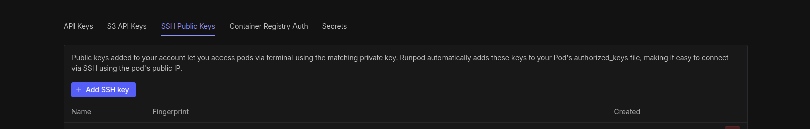
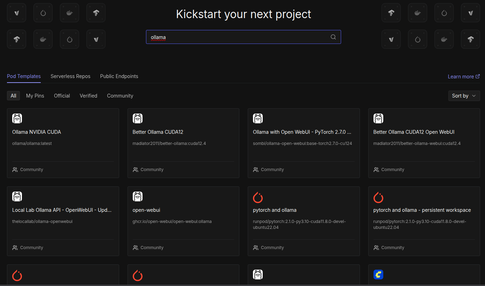
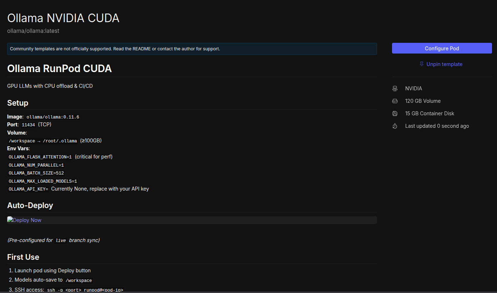
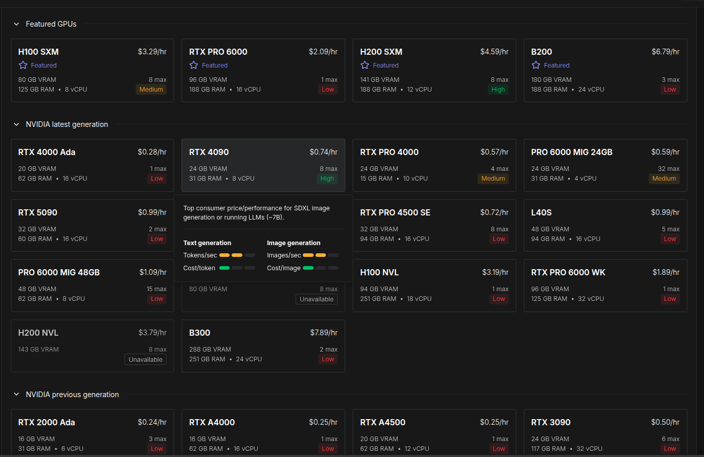
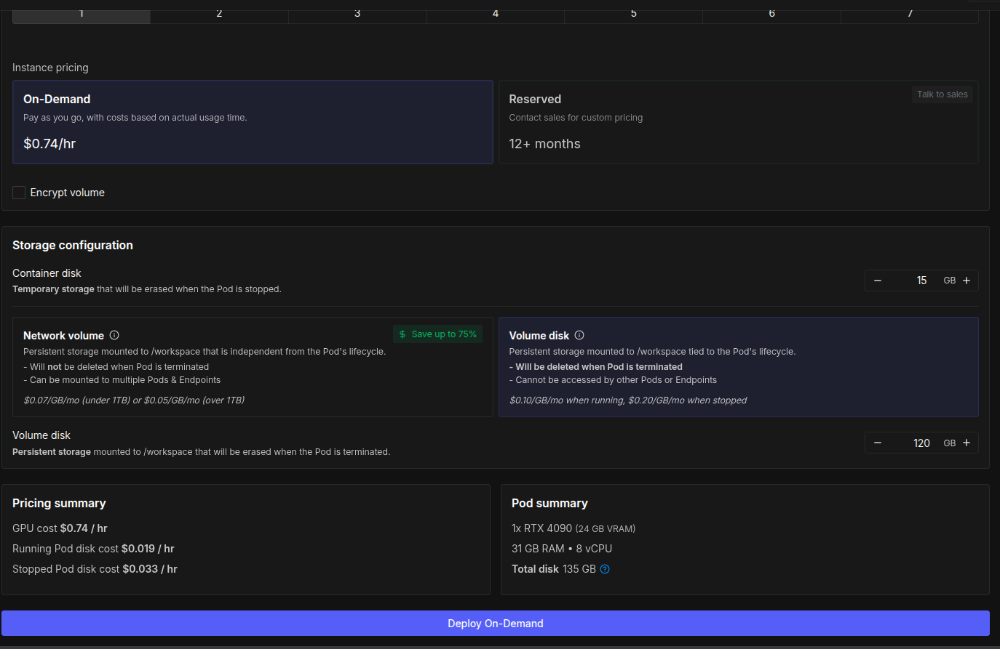
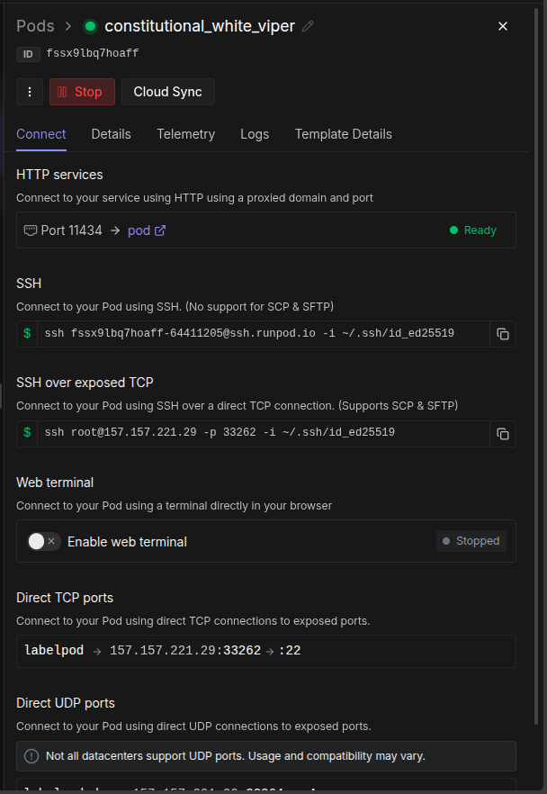

## Configurar SSH

Esta guía te lleva desde generar tu llave SSH hasta conectarte por primera vez a un pod de RunPod.

### 1. Generar una nueva llave SSH

En tu terminal local:

```sh
ssh-keygen -t ed25519 -C "tu_correo@ejemplo.com"
```

Te va a preguntar dónde guardarla:

```log
Enter a file in which to save the key (/home/tu_usuario/.ssh/id_ed25519):
```

- Si **no tienes** una llave SSH previa, solo dale **Enter** para aceptar la ruta por default.
- Si **ya tienes** una llave SSH que no quieres sobreescribir (por ejemplo, la usas para GitHub u otro servicio), escribe un nombre distinto para esta llave nueva:

```log
Enter a file in which to save the key (/home/tu_usuario/.ssh/id_ed25519): runpod_ssh
```

Después te va a pedir una passphrase (contraseña extra para la llave). Puedes dejarla vacía dando Enter dos veces, o ponerle una si quieres una capa extra de seguridad.

Al terminar, vas a tener **dos archivos** nuevos en `~/.ssh/`:
- `runpod_ssh` (o `id_ed25519`) — tu llave **privada**, nunca la compartas ni la subas a ningún lado
- `runpod_ssh.pub` (o `id_ed25519.pub`) — tu llave **pública**, esta sí se comparte/sube

### 2. Verificar permisos de la llave

SSH es estricto con los permisos de estos archivos, si no, se rehúsa a usarlos:

```sh
chmod 600 ~/.ssh/runpod_ssh
chmod 644 ~/.ssh/runpod_ssh.pub
```

### 3. Copiar tu llave pública

Muestra el contenido de tu llave pública en la terminal:

```sh
cat ~/.ssh/runpod_ssh.pub
```

Vas a ver algo como:

```
ssh-ed25519 AAAAC3NzaC1lZDI1NTE5AAAAIxxxxxxxxxxxxxxxxxxxxxxxxxxxxxxxxxxxxx tu_correo@ejemplo.com
```

Copia **toda la línea completa**.


--------

## En Runpod
- Igual que en github, el primer paso para poder conectarse y trabajar con runpod, es registrando tu clave ssh pública, ya que, ssh el es estándar de la industria para conectarse y usar hardware remoto.


- Primero Navega a account/credentials y seleccionar ssh public keys.

y añadir la nueva clave ssh

ahí pegarás la clave pública creada anteriormente.

### Correr un modelo

El primer paso para usar RunPod es probar un template ya listo con todo lo necesario para inferencia.

Un modelo de lenguaje, en su forma más pura, solo sabe hacer una cosa: predecir cuál es el siguiente
"token" (pedazo de texto) más probable, dado el texto que lleva hasta ahora. No tiene ningún concepto
nativo de "esto lo dijo el sistema", "esto lo dijo el usuario", etc. — todo eso es una convención que
se le enseña durante su entrenamiento.

Por eso, cuando queremos usarlo para "chatear", necesitamos una capa que traduzca nuestra estructura
de conversación a algo que el modelo sí entienda. Y aquí está lo interesante: **cada familia de
modelos espera un formato distinto.**

Como desarrolladores, lo más común es preparar nuestros mensajes con el formato clásico de roles:

```json
[
    {
        "role": "system",
        "content": "Eres un asistente muy útil de programación e ingeniero en sistemas..."
    },
    {
        "role": "user",
        "content": "Tux se escapó y asaltó una pescadería, ¿qué hacemos?"
    }
]
```

Pero un modelo como Llama 3.1, por dentro, en realidad espera algo así:

```
<|begin_of_text|><|start_header_id|>system<|end_header_id|>

Eres un asistente muy útil de programación...<|eot_id|><|start_header_id|>user<|end_header_id|>

Tux se escapó y asaltó una pescadería...<|eot_id|><|start_header_id|>assistant<|end_header_id|>
```

Y otro modelo, como Qwen, espera un formato completamente distinto (ChatML), con sus propios tokens
especiales. Si le mandaras el formato de Llama a Qwen (o viceversa), el modelo se confundiría —
nunca vio esos tokens en su entrenamiento.

**Aquí es donde entra Ollama**: se encarga de detectar qué modelo tienes cargado y traducir
automáticamente tu JSON de roles al formato exacto que ese modelo espera, sin que tú tengas que
preocuparte por memorizar el formato de cada familia de modelos.

---

## Desplegar Ollama en RunPod

Para comenzar a trabajar con Ollama desde RunPod, sigue estos pasos:

### 1. Busca el template de Ollama

En la sección **Hub**, busca el template de Ollama.



### 2. Configura el pod

Click en **Configure Pod**.



### 3. Selecciona una GPU

Elige la GPU según tu necesidad. Para un modelo de 7-8B parámetros cuantizado, una GPU con 16-24GB de VRAM (ej. RTX 4090) es más que suficiente.



### 4. Últimas configuraciones y deploy

Revisa el resto de la configuración (storage, puertos expuestos) y dale **Deploy**.



Al ejecutarlo, en el panel derecho va a aparecer la información de conexión, mostrando tanto la conexión HTTP como la SSH.



El http será útil para configurarlo en tu aplicación server o cliente para enviar datos a inferencia y obtener la respuesta del modelo de forma más sencilla.

### 5. Conéctate por SSH

RunPod te da un comando de ejemplo con la dirección exacta a la que conectarte. Este comando asume que tu llave SSH se llama `id_ed25519` (el nombre por default).

- Si generaste tu llave con el nombre por default, copia y ejecuta el comando tal cual te lo dan.
- Si en el paso de generar tu llave SSH le pusiste otro nombre (para no sobreescribir una llave que ya tenías), reemplaza `id_ed25519` en el comando por el nombre que elegiste.

---

## De vuelta en la terminal

**Conéctate vía SSH:**
```sh
ssh tu_codigo@ssh.runpod.io -i ~/.ssh/runpod_ssh # o id_ed25519, según el nombre de tu llave
```

**Verifica que Ollama esté corriendo:**
```sh
ollama list
```

Si el comando anterior da error de conexión, arráncalo manualmente. El `&` al final lo manda a segundo plano para no bloquear la terminal:
```sh
ollama serve &
```

**Configura dónde se guardan los modelos descargados**, para que persistan aunque detengas el pod (por default, Ollama guarda en una ruta que se pierde al hacer Stop):
```sh
export OLLAMA_MODELS=/workspace/ollama_models
mkdir -p /workspace/ollama_models
```

**Descarga un modelo:**
```sh
ollama pull llama3.1:8b
```

**Corre el modelo para probarlo** directo desde la terminal, antes de conectarlo a cualquier API:
```sh
ollama run llama3.1:8b
```